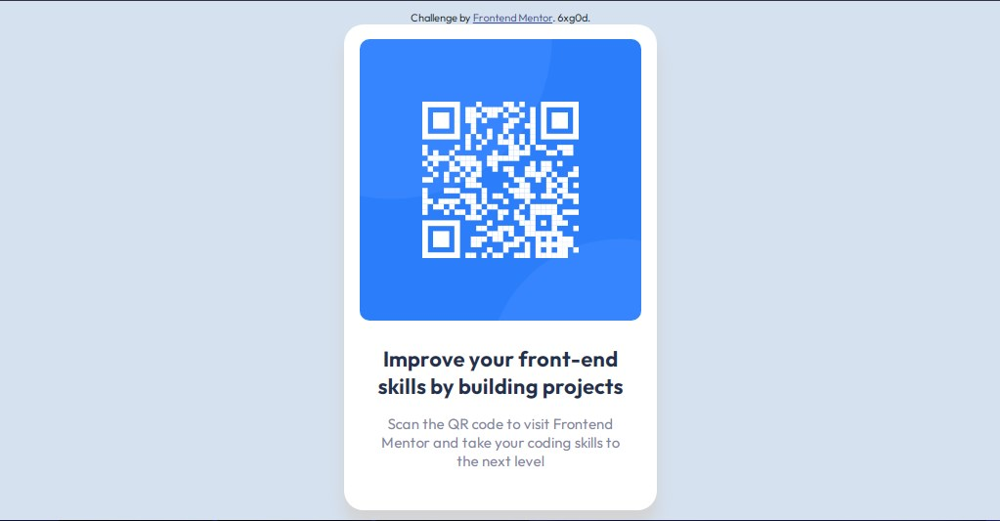

# Frontend Mentor - QR code component solution

This is a solution to the [QR code component challenge on Frontend Mentor](https://www.frontendmentor.io/challenges/qr-code-component-iux_sIO_H). Frontend Mentor challenges help you improve your coding skills by building realistic projects. 

## Table of contents

- [Overview](#overview)
  - [Screenshot](#screenshot)
  - [Links](#links)
- [My process](#my-process)
  - [Built with](#built-with)
  - [What I learned](#what-i-learned)
  - [Continued development](#continued-development)
- [Author](#author)
- [Acknowledgments](#acknowledgments)

## Overview

### Screenshot

### Links

- Solution URL: [Add solution URL here](https://your-solution-url.com)
- Live Site URL: [Add live site URL here](https://your-live-site-url.com)

## My process

### Built with

- Semantic HTML5 markup
- CSS
- Flexbox

### What I learned
 I fight a little bit trying to be as semantic as possible, i think there's no just one way to see the semantic, but a lot of ways to organize the same content in a meaningful way. Also, i have to grab some paper and a pen to draw some sketches and explain to myself different ways to write the code, making me think far away from my initial thoughts. In general, this was a simple project, but made me spend a whole hour thinking the semantic. Maybe due to the short amount of code lines that requires, semantic doesn't have too much weight, but i still think that even simple projects should have a semantic HTML code :)

### Continued development

I want to add more interactivity in the future. That the user have the possibility to switch to the back side of the card, maybe a couple css effects to start learning and practicing animations.

## Author

- Frontend Mentor - [@6xg0d](https://www.frontendmentor.io/profile/6xg0d)

## Acknowledgments

Working in this project was fun. I don't think it's the best solution yet, but in the future i'll watch this and improving using the knowledge i got from the past projects. Thanks to Frontend Mentor for this project ideas, really fun, and a huge tool to the people that often doesn't know what to code to practice like me haha.
